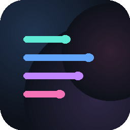
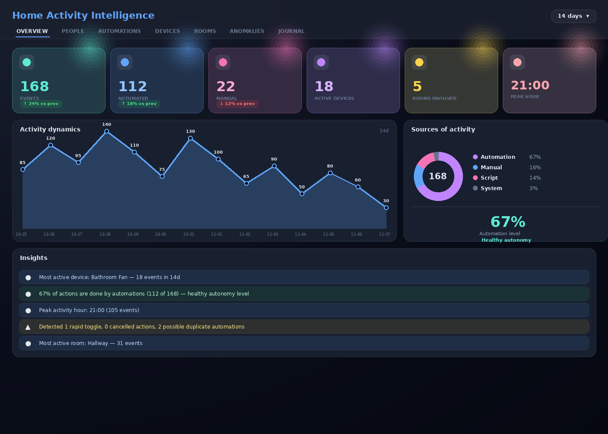
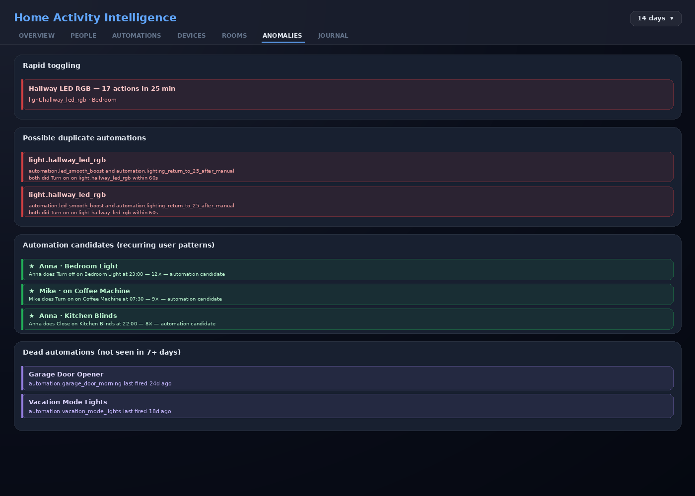
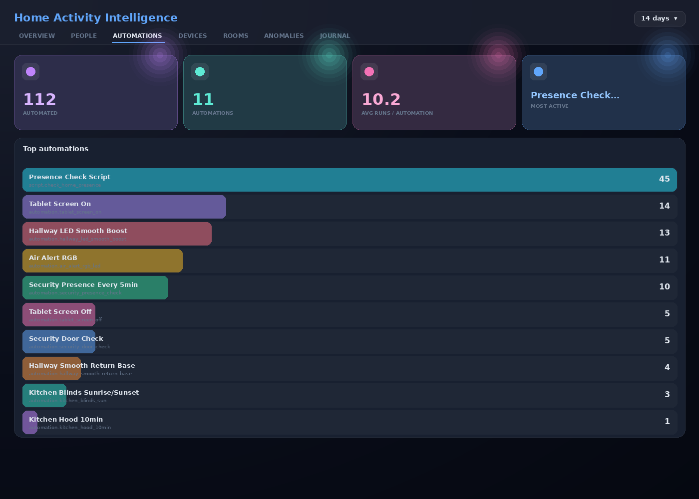
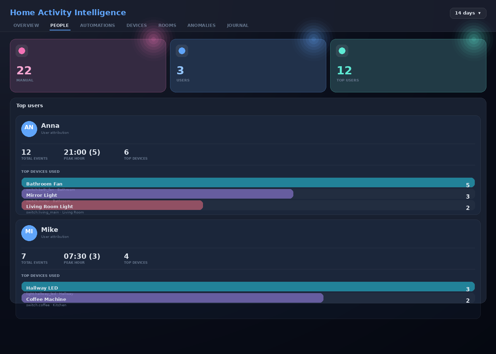
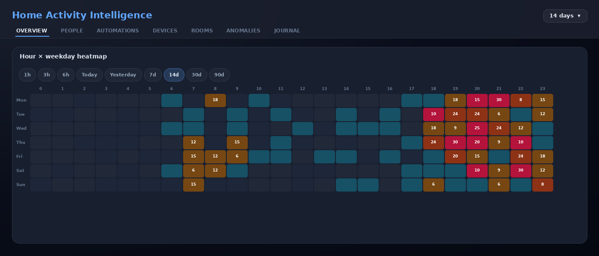

# Home Activity Intelligence

<p align="center">
  
</p>

> Не просто журнал событий — а аналитика умного дома, которая объясняет **кто**, **когда**, и **зачем** что-то делает.

[](https://github.com/makarseo/ha-user-activity-tracker/releases)
[](https://hacs.xyz/)
[](https://www.home-assistant.io/)

[🇬🇧 English](README.md) · 🇷🇺 Русский



---

## Что это и зачем

Home Assistant из коробки знает что произошло, но **не знает кто это сделал и почему**. Logbook — это голый список событий. Recorder — техническое хранилище.

Этот компонент превращает сырые события в **операционную аналитику умного дома**:
- кто из домашних чем реально пользуется
- какие автоматизации работают полезно, а какие срабатывают вхолостую
- где автоматизации мешают пользователю и наоборот
- какие повторяющиеся ручные действия пора автоматизировать
- где есть конфликты, дубли, частые тычки и аномалии

Хранит всё в **отдельной SQLite** базе (`/config/.storage/user_activity.db`), не раздувает HA recorder. Без зависимостей, без облака, без телеметрии.

---

## Главные преимущества

| | |
|---|---|
| **Реальная атрибуция** | Каждое событие помечено: User / Automation / Script / System. Видно конкретного пользователя и конкретную автоматизацию. |
| **Friendly names + комнаты** | Резолвятся через registry при записи — в UI красивые имена, не голые `entity_id`. |
| **8 детекторов аномалий** | Дубли автоматизаций, частые переключения, мёртвые автоматизации, конфликты, кандидаты на автоматизацию. |
| **Сравнение периодов** | KPI с дельтами `+24% vs prev`. Сразу видно тренд. |
| **Heatmap с периодами** | Час × день недели. Чипы переключения: 1ч / 3ч / 6ч / Сегодня / Вчера / 7д / 14д / 30д / 90д. |
| **REST API** | 13 эндпоинтов. Используй из Node-RED, Apps Script, или внешних дашбордов. |
| **Multi-language** | Английский, Украинский, Русский. Переключается автоматически. |
| **Zero-config** | Установил → Restart → готово. |

---

## Скриншоты

### Обзор (Overview)


### Аномалии — встроенный аудит дома


### Автоматизации


### Люди — профили пользователей


### Heatmap с переключаемыми периодами


---

## Установка через HACS

1. HACS → **Integrations** → ⋮ → **Custom repositories**
2. Repository: `https://github.com/makarseo/ha-user-activity-tracker`
3. Type: **Integration** → **Add**
4. В списке HACS найди **User Activity Tracker** → **Download**
5. **Restart Home Assistant**
6. Settings → Devices & Services → **Add Integration** → ищи `User Activity` → добавь
7. В сайдбаре появится **Home Activity** с иконкой графика

---

## Что трекается

Каждый вызов сервиса (`EVENT_CALL_SERVICE`) в одном из доменов:

```
switch · light · input_boolean · input_button · button · scene · script
cover · lock · media_player · climate · fan · vacuum
select · input_select · number · input_number
humidifier · water_heater · alarm_control_panel
remote · siren · valve · lawn_mower
```

---

## Алгоритмы детекции аномалий

8 детекторов поверх собранных событий. Каждый запускается на вкладке `Anomalies` и через REST `/api/user_activity_tracker/anomalies`.

### 1. Rapid toggling — частые переключения

Одно устройство переключилось 8+ раз за 30 минут. Свет дёргается каждые 30 секунд → плохой PIR-таймер. Кандидат на хистерезис, debounce или объединение логики.

### 2. User cancelled by automation

Пользователь сделал действие, через ≤5 мин автоматизация сделала противоположное. Автоматизация мешает живому человеку.

### 3. Manual override after automation

Автоматизация сделала действие, пользователь сразу руками вернул как было. Пользователь не согласен с логикой автоматизации.

### 4. Possible duplicate automations

Две автоматизации сделали одно и то же действие на одном entity в окне 60 секунд. Самая частая причина "почему свет включается через раз".

### 5. Dead automations

Автоматизации, которые раньше работали, но не срабатывали 7+ дней. Возможно сломан триггер или автоматизация устарела.

### 6. Low-impact automations

Автоматизация запускалась 3+ раз, но управляет только одним entity одним сервисом. Избыточная сложность — кандидат на свёртку.

### 7. Routine candidates — кандидаты на автоматизацию ⭐

Один и тот же пользователь делает одно и то же действие на одном entity в один и тот же час 5+ раз. **Самая ценная штука**: если каждый день в 22:00 ты вручную выключаешь свет в гостиной — это пропавшая автоматизация.

### 8. Night activity

События между 00:00 и 06:00. Часто признак того, что что-то идёт не по плану — лажующий датчик, забытое устройство в режиме "on".

---

## REST API

13 эндпоинтов под `/api/user_activity_tracker/`. Все требуют HA-аутентификацию.

```bash
curl -H "Authorization: Bearer $HA_TOKEN" \
  "http://homeassistant.local:8123/api/user_activity_tracker/anomalies?days=30" \
  | jq '.routine_candidates'
```

Полный список endpoint'ов — в [English README](README.md#rest-api).

---

## Privacy

- 100% локально. Никакого облака, никакой телеметрии.
- Никаких внешних сервисов.
- Опенсорс.

---

## License

MIT.
